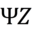

#  PsiZ Collect

PsiZ Collect is intended to be a template for creating a web-based application for collecting human similarity judgments. It has been designed to minimize deployment effort. Since it is a web-based application, some assembly is required. Once data is collected, it can be analyzed using the *psiz* python package which can be cloned from [GitHub](https://github.com/roads/psiz).

This setup guide assumes a LAMP stack, a registered domain name, and a SSL certificate. While the code may work with other server configurations, it has only been tested using a LAMP stack.
<!-- Perspective player and content/payload -->
<!-- TODO <user> refers to ...; <my_domain> refers to ... -->

## How it works
1. Install application.
2. Create a new collection project.
3. Start collecting your data.

## 1. Install application
* 1.1 Clone webfiles to desired location.
* 1.2 Set up MySQL database.
* 1.3 Set environment variables.
* 1.4 Set up re-write rules.
* 1.5 (optional) Set AWS and AMT credentials (only necessary if using AMT)

<!-- TODO the reminder of this document assumes that the code is being installed at /var/www/psiz.org/collect/psiz-collect/. You will have to modify the relevant commands to work for your setup. -->

### 1.1 Clone webfiles to desired location.
<!-- TODO All of the relevant webfiles are contained in the directory `website/`-->
```
DIR_COLLECT
+-- /php
+-- /projects
+-- /static
+-- /templates
+-- /collect.php
```

### 1.2 Set up MySQL database.
<!-- TODO -->
To setup the MySQL database we will be creating a credentials file and creating the relevant database.

MySQL credentials are assumed to be stored in the file `/home/<user>/.mysql/credentials`. If you have not done so already, create the hidden directory `.mysql` and the extensionless plain text `credentials` file. 
<!-- TODO Set the permissions of the -->
Using a text editor (such as nano), open `credentials` and add the following block:
```
...

[psiz]
servername = localhost
username = <mysql_username>
password = <myql_password>
database = psiz

...
```
where `<mysql_username>` and `<myql_password>` have been appropriate substituted with your credentials. This file is intentionally located outside the website root directory to prevent the general public from obtaining these credentials.

If you will be running AMT workers using the voucher system, you will also want to add the following block to `credentials` (if you haven't already):
```
...

[amt_voucher]
servername = localhost
username = <mysql_username>
password = <myql_password>
database = amt_voucher

...
```

The MySQL database is created by logging into MySQL and executing ``mysql> SOURCE install_db_psiz.sql;``. Note that this code will only create a database called **psiz** if it doesn't already exist. If you will be running AMT workers using the voucher system, you will also want to install the **amt_voucher** database by executing ``mysql> SOURCE install_db_voucher.sql;``.

<!-- TODO database organization -->
status_code
    0 - created, not completed, not expired
    1 - completed, keep
    2 - not completed, expired
    3 - completed, dropped

### 1.3 Set environment variables.
<!-- TODO DIR_COLLECT and MYSQL_CRED -->
Instead of assuming that DIR_COLLECT will also be the root of the website, the PHP code uses the environment variable DIR_COLLECT. In addition we will use the environment variable MYSQL_CRED to store the path to your MySQL credentials. These environment variables can be set by editing your vhost file under `/etc/apache2/sites-available/`. Don't forget to call `sudo service apache2 restart` when you are done modifying the vhost.
```
ServerAdmin admin@host
DocumentRoot /var/www/my_website
ServerName local.server
ServerAlias local.alias.server
SetEnv MYSQL_CRED /home/<user>/.mysql/credentials <-- add this line
SetEnv DIR_COLLECT /var/www/my_website/path_to_collect <-- add this line
```
If the PsiZ Collect website resides at the root of the website, then DIR_COLLECT will have the same path as DOCUMENT_ROOT. If you do not have control of the vhost file, you can set the variable in a `.htaccess` file. However, this approach requires that `SetEnv` be allowed in `.htaccess` files, which is specified using the `AllowOverride` directive.

### 1.4 (optional) Set up re-write rules.

<!-- TODO -->
Modify the .htaccess file at the root of the host website.
```
RewriteEngine on
RewriteRule ^collect/([A-Za-z0-9]+)/$ collect/psiz-collect/index.php?projectId=$1 [QSA]
```

### 1.5 (optional) Set AWS and AMT credentials
<!-- TODO -->
<!-- store credentials at ~/.aws/credentials -->

<!-- TODO hello world -->

## 2. Create a new project.
To create a new project, start by creating a new project directory inside the `projects` directory. The new project directory should be given a unique name with no whitespace.

Once you have created a new project directory, you must supply the following items:
1. A set of stimuli.
2. One or more collection protocols.
3. (optional) Additional content such as a consent form,
instructions, or a survey.

You should consider creating a new project when you would like to infer an embedding for a new, distinct set of stimuli. If you are looking to integrate new stimuli with an existing set of stimuli, you may want to consider expanding the stimuli list of an existing project.

A minimal project will contain a file named `stimuli.txt` and one json file specifying the collection protocol.

<!-- `stimuli.txt` and protocols in directory, actual files can be placed anywhere on the server -->

### 2.1 Stimuli
The stimuli are the media that you will ask participants to judge. Raw text, images, audio and video can be used.

The following file formats are supported:
 * images: 'png', 'jpg'
 * audio: 'mp3', 'wav', 'ogg'
 * video: 'mp4', 'webm', 'ogv' <!-- TODO verify ogv actually works-->

NOTE: It is assumed that .ogv indicates a video file while .ogg indicates an audio file (as per the current recommendation by the developer).

Any stimuli that will be used need to be listed in a file named `stimuli.txt` which should then be placed in the project directory. The `stimuli.txt` file must contain the complete filepaths to all stimuli (one stimulus per line). The application will assume:
1. That each line points to a unique stimulus.
2. Stimuli filenames are assumed to be unique (i.e., the last part of the filepath).
3. No other stimuli will be used other than what is on the list.
4. All stimulus filepaths end with an appropriate file extension.
    * Filepaths without file extensions will be treated as raw text.

By requiring filepaths, you can create projects that source stimuli from many different locations on your server.

If you are looking for a method to help create this file for an existing directory of stimuli, one option is to use the GNU or BSD `find` command. For example, the following command finds all files with .jpg and .png file extensions within the `path/to/dataset` directory:

```
find path/to/dataset -type f -iname "*.jpg" -o -iname "*.png" > stimuli.txt
```

It is critically important that the order of the stimuli in stimuli.txt file not change once you have started collecting data. Instead of storing filenames, only the indices are stored. It's fine to add additional lines for new stimuli, but do not alter existing lines.

### 2.2 Collection Protocol(s)
<!-- TODO describe how backend PHP attempts to balance protocols -->
An experiment protocol is a JSON file that specifies how to generate a docket. A docket is a sequence of pages to show a participant. Most of these pages will be trials, but can also be instructions, consent forms or surveys. To provide sufficient flexibility, dockets can be specified in a number of ways.

The most low-level docket component is a *trial*. A trial requires the following information:
* query: int,
* references: array,
* nSelect: int,
* isRanked: bool
* isCatch: bool
By using trials, you can specify exactly what you would like participants to see.

The next level of specificity is a *trialSpec*, which requires the following information:
* nReference: int,
* nSelect: int,
* isRanked: bool
* isCatch: bool
By using a trialSpec, you can indicate the trial configuration but allow the actual stimuli to be randomly selected.

If you would like a block of randomly selected trials, you can use a *blockSpec*. A blockSpec requires the following information:
* nTrial: int
* nReference: int,
* nSelect: int,
* isRanked: bool
* (optional) nCatch: int

<!-- TODO examples, breaks -->
Breaks can be added by interleaving a messages between blockSpec's

content: trial | trialSpec | blockSpec | message

message
    html requires field "fname" with appropriate path
can have multiple blockSpec


shuffle: shuffle order of trials
    shuffle (should this always occur? no, because of spacing for catch trials
* Stimuli are reference by their index of occurence in `stimuli.txt`. The index is assumed to start at 0 and go to N-1 where N indicates the total number of stimuli listed in `stimuli.txt`.
* protocol names MUST follow the format `protocol*.json` in order to be detected. The `*` character indicates the typical wildcard format.
* protocols no longer in use, can be removed from the EXPERIMENT_DIR. Doing so may
    improve page loading speed for subjects if there are hundreds of protocols.
* Within an experiment, each protocol should have a unique name, do not re-use
    names even if the directory no longer contains that protocol since protocols
    are assigned by looking up usage history in a database.
* protocols may reference other pages to display before (?)
* no default protocol since money may be on the line
* Each trial can have a different configuration (number of references, number of choices, ranked) by using a deterministic protocol.
* Protocols will need to be created by the user but can be checked for validity using the provided python script `check_protocol.py`.
* specifying breaks TODO
* make clear that if no consent is provided in project directory, there is no default, i.e., assumes that it has been obtained some other way

For clarity to the participant, it is probably best not to mix unranked and ranked trials within a session.


### 2.3 Additional Content (optional)
<!-- TODO -->
Additional content is displayed as a `message`
Consent Form
Experiment Instructions
Survey

## Additional details

A trial is only shown once all of the assets have been loaded in the browser. This behavior enforces the constaint that participants are presented with all trial content simultaneously. To reduce time spent waiting for stimuli to load, the application starts loading all stimuli, in the order of their occurrence, after the first page has loaded.

## Python scripts

A python script is included to check the validity of a protocol. If a protocol is specified incorrectly, the application will do it's best to recover but may yield dockets that differ from what was intended. For example, if a protocol requests more catch trials `nCatch` than the total number of trials `nTrial`, the docket will contain `nTrial` catch trials.

## Host server organization
On the web server, the assume directory structure is as follows:
`.psiz-collect/`
    `python/`
        `extract_observations.py`
    `projects/`
        `my_project_0/`
            `obs.hdf5`
            `summary.txt`
        `my_project_1/`
            `obs.hdf5`
            `summary.txt`

## Miscellaneous
The Python script `extract_observations.py` is used for parsing MySQL data
into a psiz.trials.Obsevation object.

obs will be created and placed in a directory with the same name as the provided project ID. Any existing data will be over-written.

Some summary information is also written to summary.txt
